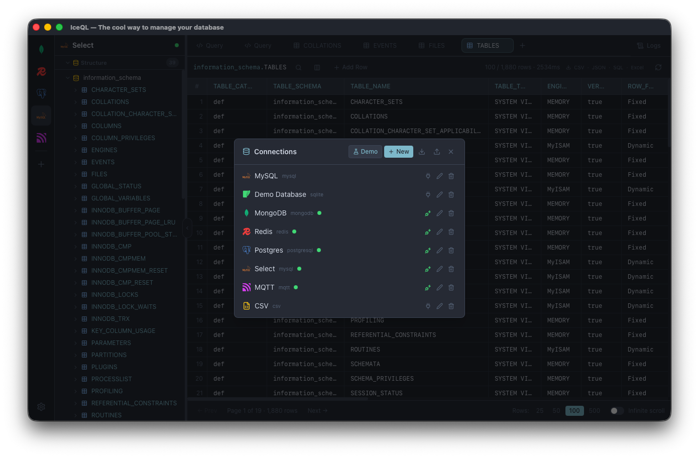
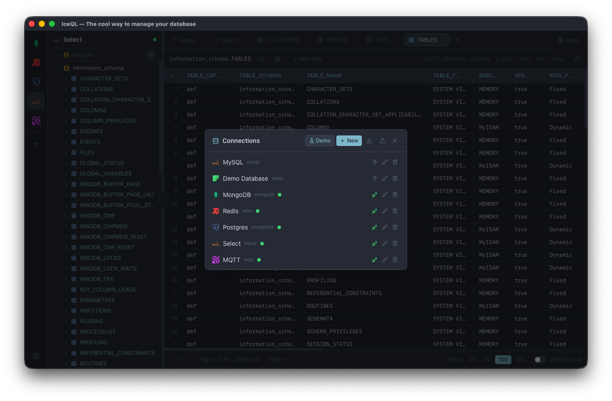
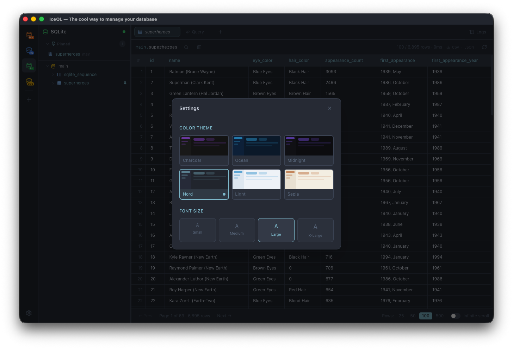

# IceQL

> **The cool way to manage your database**

A modern, cross-platform desktop SQL client built with Tauri 2 + React. Inspired by TablePlus, with an icy blue dark theme.

 [iceql.com](https://iceql.com)



## Screenshots

| | |
|---|---|
|  |  |

## Features

- **Multi-database support** — PostgreSQL, MySQL/MariaDB, SQLite
- **Connection manager** — save, edit, and delete named connections
- **Database tree** — browse connections → databases → tables → columns
- **Table data viewer** — paginated browsing with row numbers
- **Inline editing** — double-click any cell to edit; Commit / Revert buttons appear when changes are pending
- **SQL editor** — CodeMirror 6 with SQL syntax highlighting, run with `Cmd+Enter`
- **Multi-tab** — open multiple tables and query editors simultaneously
- **SQL query logs** — resizable side panel showing every executed query with status, duration, and error details

## Tech Stack

| Layer | Technology |
|---|---|
| Desktop shell | Tauri 2.x (Rust) |
| Frontend | React 18 + TypeScript + Vite |
| Styling | Tailwind CSS 3 |
| SQL editor | CodeMirror 6 |
| Data grid | TanStack Table |
| Database driver | sqlx (postgres, mysql, sqlite) |

## Prerequisites

- [Node.js](https://nodejs.org/) 18+
- [Rust](https://rustup.rs/) (stable toolchain)
- Tauri CLI

```bash
cargo install tauri-cli
```

## Getting Started

```bash
# Clone the repo
git clone https://github.com/papateo/iceql.git
cd iceql

# Install frontend dependencies
npm install

# Run in development mode
npm run tauri dev
```

## Build

```bash
# Production build (outputs installer to src-tauri/target/release/bundle/)
npm run tauri build
```

## Project Structure

```
iceql/
├── src/                        # React frontend
│   ├── components/
│   │   ├── AddConnectionModal.tsx
│   │   ├── ConnectionsPanel.tsx
│   │   ├── QueryView.tsx
│   │   ├── ResultsPanel.tsx
│   │   ├── SqlEditor.tsx
│   │   ├── SqlLogPanel.tsx
│   │   ├── TabBar.tsx
│   │   └── TableDataView.tsx
│   ├── store/
│   │   └── appStore.ts         # Global state (connections, tabs, logs)
│   └── types/
│       └── index.ts
├── src-tauri/                  # Rust backend
│   ├── src/
│   │   ├── commands.rs         # Tauri commands
│   │   ├── db.rs               # Database connection & query logic
│   │   ├── models.rs           # Shared data types
│   │   ├── persistence.rs      # Saved connections (JSON)
│   │   └── lib.rs
│   ├── capabilities/
│   │   └── default.json        # Tauri ACL permissions
│   └── tauri.conf.json
└── README.md
```

## Keyboard Shortcuts

| Shortcut | Action |
|---|---|
| `Cmd+Enter` | Run SQL query |
| `Enter` / `Tab` | Confirm cell edit |
| `Escape` | Cancel cell edit |

## License

MIT
